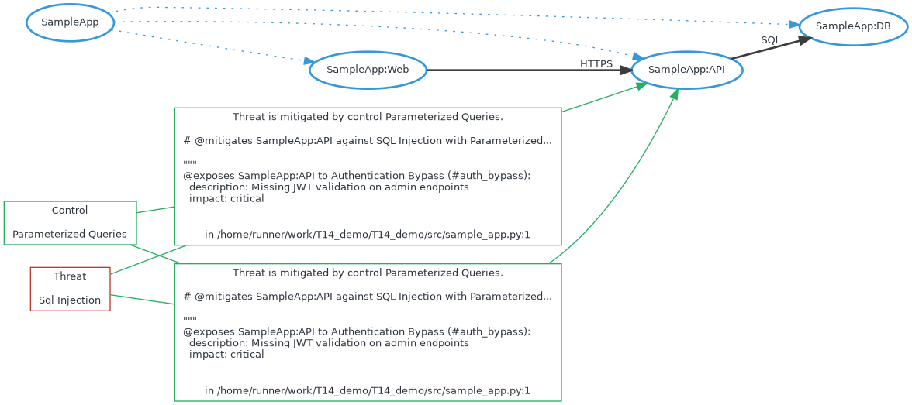

# T14 - Threat Modeling As Code Threat Model

ThreatSpec project for CI-driven Threat Modeling


# Diagram



# Exposures


# Acceptances


# Transfers


# Mitigations

## Sql injection against SampleApp:API mitigated by Parameterized queries


```
# @mitigates SampleApp:API against SQL Injection with Parameterized Queries

"""
@exposes SampleApp:API to Authentication Bypass (#auth_bypass):
  description: Missing JWT validation on admin endpoints
  impact: critical

```
/home/runner/work/T14_demo/T14_demo/src/sample_app.py:1

## Sql injection against SampleApp:API mitigated by Parameterized queries


```
# @mitigates SampleApp:API against SQL Injection with Parameterized Queries

"""
@exposes SampleApp:API to Authentication Bypass (#auth_bypass):
  description: Missing JWT validation on admin endpoints
  impact: critical

```
/home/runner/work/T14_demo/T14_demo/src/sample_app.py:1


# Reviews


# Connections

## SampleApp:Web To SampleApp:API
HTTPS

```
# @connects SampleApp:Web to SampleApp:API with HTTPS


"""
@exposes SampleApp:API to Authentication Bypass (#auth_bypass):
  description: Missing JWT validation on admin endpoints

```
/home/runner/work/T14_demo/T14_demo/src/sample_app.py:1

## SampleApp:API To SampleApp:DB
SQL

```
# @connects SampleApp:API to SampleApp:DB with SQL


"""
@exposes SampleApp:API to Authentication Bypass (#auth_bypass):
  description: Missing JWT validation on admin endpoints

```
/home/runner/work/T14_demo/T14_demo/src/sample_app.py:1

## SampleApp:Web To SampleApp:API
HTTPS

```
# @connects SampleApp:Web to SampleApp:API with HTTPS


"""
@exposes SampleApp:API to Authentication Bypass (#auth_bypass):
  description: Missing JWT validation on admin endpoints

```
/home/runner/work/T14_demo/T14_demo/src/sample_app.py:1

## SampleApp:API To SampleApp:DB
SQL

```
# @connects SampleApp:API to SampleApp:DB with SQL


"""
@exposes SampleApp:API to Authentication Bypass (#auth_bypass):
  description: Missing JWT validation on admin endpoints

```
/home/runner/work/T14_demo/T14_demo/src/sample_app.py:1


# Components

## SampleApp:API

## SampleApp:Web

## SampleApp:DB


# Threats

## Sql injection


# Controls

## Parameterized queries
