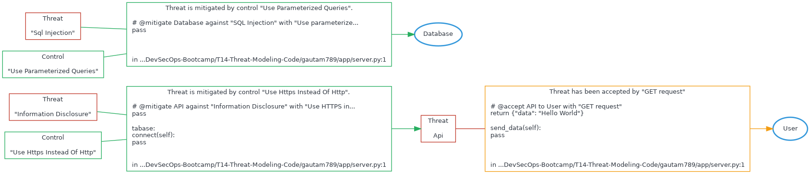

# T14 Threat Modeling As Code Threat Model

Threat model generated from server.py annotations


# Diagram



# Exposures


# Acceptances

## Api to User
"get request"

```
        # @accept API to User with "GET request"
        return {"data": "Hello World"}

    def send_data(self):
        pass


```
/home/gautam/DevSecOps-Bootcamp/T14-Threat-Modeling-Code/gautam789/app/server.py:1


# Transfers


# Mitigations

## "information disclosure" against API mitigated by "use https instead of http"


```
        # @mitigate API against "Information Disclosure" with "Use HTTPS instead of HTTP"
        pass

class Database:
    def connect(self):
        pass

```
/home/gautam/DevSecOps-Bootcamp/T14-Threat-Modeling-Code/gautam789/app/server.py:1

## "sql injection" against Database mitigated by "use parameterized queries"


```
        # @mitigate Database against "SQL Injection" with "Use parameterized queries"
        pass


```
/home/gautam/DevSecOps-Bootcamp/T14-Threat-Modeling-Code/gautam789/app/server.py:1


# Reviews


# Connections


# Components

## API

## Database

## User


# Threats

## "information disclosure"


## "sql injection"


## Api


# Controls

## "use https instead of http"

## "use parameterized queries"
